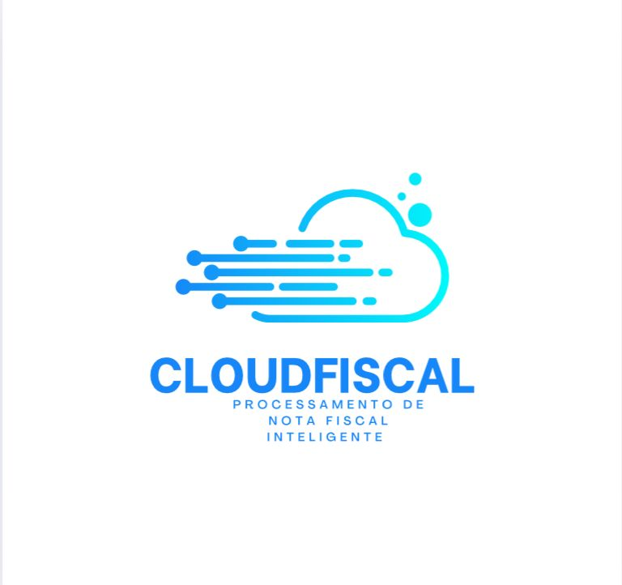
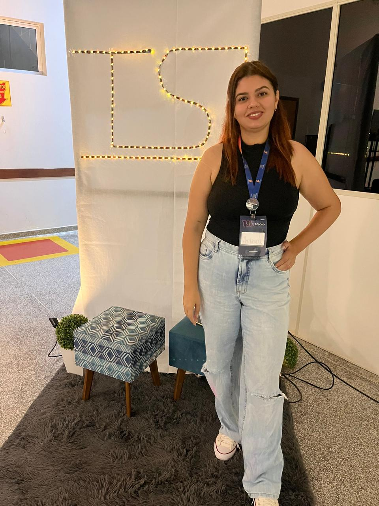

<div align="justify">

# 📌 CLOUDFISCAL - Processamento de Notas Fiscais

<div align="center">
  
</div>

## Visão Geral
Este projeto é um sistema automatizado para processamento de notas fiscais, utilizando AWS Lambda, API Gateway, S3, Textract, NLTK e Step Functions para orquestração do fluxo de trabalho. O objetivo é extrair e estruturar informações das notas fiscais enviadas pelos usuários.


---

## 📖 Índice

1. [🚀 Tecnologias Utilizadas](#-tecnologias-utilizadas) 
2. [🛠️ Arquitetura](#-arquitetura) 
3. [🌍 Endpoints da API ](#-endpoints-da-api)
4. [🔬 Testes locais](#-testes-locais)
5. [📦 Deployment](#-deployment)
6. [📝 Atribuições de Tarefas](#-atribuições-de-tarefas)  
7. [👨‍💻 Autores](#-autores)

---

## 🚀 Tecnologias Utilizadas  

### 🐍 **Linguagem**

- Python 3.12  

### 🛠️ **Frameworks e Bibliotecas**

- AWS SAM - Serverless Application Model
- Boto3 - SDK da AWS para Python
- NLTK - Biblioteca para processamento de linguagem natural

### ☁️ **Serviços AWS**

- Lambda - Execução de código serverless  
- API Gateway - Exposição de endpoints
- Bucket S3 - Armazenamento do arquivos  
- Textract - Extração de dados de notas fiscais

### 💻 **Ferramentas de Desenvolvimento**

- Docker - Para execução local da Função Lambda
- Git e GitHub - Controle de versão
- Postman - Para testes locais

---
## 🌍 Endpoints da API

### 1. Upload de Nota Fiscal

- **Método**: POST
- **Endpoint**: `/api/v1/invoice`
- **Descrição**: Envia uma nota fiscal para processamento.


---
## 📝 Requisitos

-

## 🔬 Testes Locais

1. **Usando Postman**:

   - Faça um POST para `/api/v1/invoice` enviando um arquivo como `multipart/form-data`.

2. **Usando AWS SAM**:

   - Rodar `sam local invoke` para testar funções Lambda individualmente.
   - Rodar `sam local start-api` para testar a API Gateway localmente.

---

## 📦 Deployment

Para implantar a aplicação na AWS:

```sh
sam build
saM deploy --guided

```
## 📝 Atribuições de Tarefas

- Roberta: Desenvolvimento da API REST e integração com o Bucket S3, utilizando AWS SAM
- Amanda: Implementação do Textract e utilização do SpaCy para processamento de dados
- Bernardo: Desenvolvimento e integração do modelo de LLM (Large Language Model)

## 🤝 Autores  

👩‍💻 **Amanda Campos Ximenes**  

👨‍💻 **Bernardo Ramos Alonso Ribeiro**

👩‍💻 **Roberta Kamilly Magalhães de Oliveira**  

<div align="center">
  
  
  
</div>

</div>
