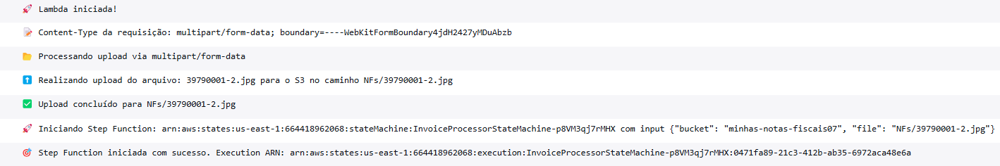
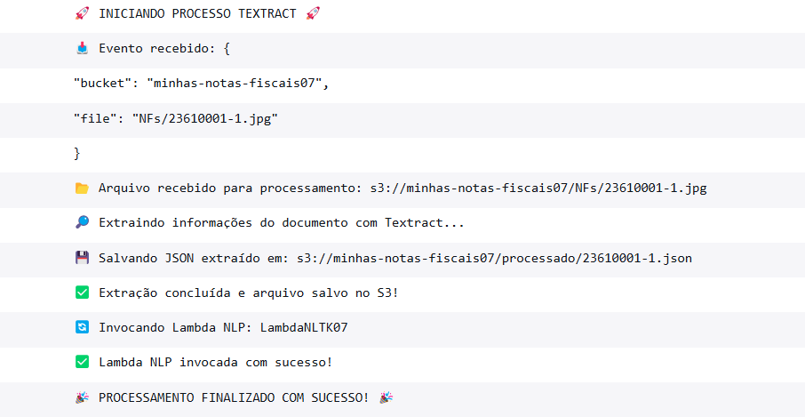
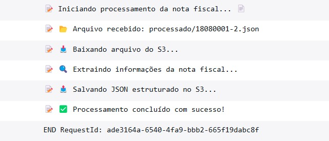

<div align="justify">

# 🧾 CLOUDFISCAL - Processamento de Notas Fiscais

<div align="center">
  
</div>

## 📌 Visão Geral

Este projeto implementa um sistema automatizado para processamento de notas fiscais, utilizando serviços da AWS para extrair, processar e estruturar informações de forma eficiente. A arquitetura é baseada em AWS Lambda, API Gateway, S3, Textract, NLTK e Step Functions, garantindo escalabilidade e automação do fluxo de trabalho.

O principal objetivo é extrair, processar e organizar os dados das notas fiscais enviadas pelos usuários, transformando-os em um formato estruturado para facilitar análises.


 
 
 
 
 
 
 
 
 
 
 
 
 

---

## 📖 Índice

1. [🚀 Tecnologias Utilizadas](#-tecnologias-utilizadas)
2. [📝 Requisitos](#-requisitos) 
3. [🛠️ Arquitetura e Funcionalidades](#-arquitetura-e-funcionalidade)
3. [🛠️ Passos para Execução](#-passos-para-execução)
4. [📦 Deployment](#-deployment)
5. [📝 Responsabilidades da equipe](#-responsabilidades-da-equipe)  
6. [👨‍💻 Autores](#-autores)
7. [📂 Estrutura de Pastas](#-estrutura-de-pastas)
8. [💻 Captura da página web](#-captura-da-pagina-web)

---

## 🚀 Tecnologias Utilizadas  

### 💻 **Linguagem**

#### 🐍 Backend

- Python 3.12 

#### 👨‍💻 Frontend

- HTML 5
- CSS 3
- JavaScript CMAScript 5.1.

### 🛠️ **Frameworks e Bibliotecas**

- AWS SAM(v1.136.0) - Serverless Application Model
- Boto3(v1.37.23) - SDK da AWS para Python
- NLTK(v3.9.1) - Biblioteca para processamento de linguagem natural

### ☁️ **Serviços AWS**

- Lambda - Execução de código serverless  
- API Gateway - Exposição de endpoints
- Bucket S3 - Armazenamento do arquivos  
- Textract - Extração de dados de notas fiscais
- AWS Step Functions - Orquestração do fluxo de processamento
- AWS CloudWatch - Monitoramento e logs

### 💻 **Ferramentas de Desenvolvimento**

- Docker(v27.4) - Para execução local da Função Lambda
- Git e GitHub(2.49.0) - Controle de versão
- Postman(v11.27.3) - Para testes locais

---

## 📝 Requisitos
Para executar o projeto localmente, você precisará:

- Python 3.12 instalado
  - Versão 3.13 do python até o presente momento(31/03/2025) gera instabilidades e bugs no funcionamento do código .

- AWS CLI configurado

- AWS SAM instalado

- Docker instalado para testes locais das Lambdas

- Postman ou outra ferramenta para testar os endpoints

- Conta AWS com permissões para Lambda, S3, API Gateway e Textract

## 🛠️ Arquitetura e Funcionalidades

### 🔄 Fluxo de Processamento

####  Lambda 1 - `InvoiceFunction`:

##### Responsável por iniciar o fluxo de processamento e interagir com os serviços AWS:

- Monitora eventos do CloudWatch e utiliza variáveis de ambiente para configuração.

- Define as rotas da API e interage com o API Gateway.

- Faz o upload da nota fiscal para o bucket S3, armazenando-a na pasta `NFs/`.

- Inicia o Step Function, que gerencia a execução das próximas etapas do processo.

##### 📟 Logs do AWS CloudWatch:
<div align="center">
  
</div>

#### Lambda 2 - `LambdaTextract`:

##### Processa a nota fiscal utilizando OCR via Amazon Textract:

- Acessa a nota fiscal armazenada no S3 na pasta `NFs/`.

- Suporta múltiplos formatos de imagem para extração de dados.

- Utiliza o Amazon Textract para converter o conteúdo da nota fiscal em texto, palavra por palavra.

- Salva o resultado em JSON na pasta `processado/` do S3.

- Ao concluir, aciona a próxima função `LambdaNLTK` para estruturar os dados extraídos.

##### 📟 Logs do AWS CloudWatch:
<div align="center">
  
</div>


#### Lambda 3 - `LambdaNLTK`:

##### Aplica processamento de linguagem natural (NLP) para estruturar os dados extraídos:

- Utiliza NLTK (Natural Language Toolkit) e Regex para refinar o texto.

- Emprega AWS Lambda Layers para carregar as dependências do NLTK.

- Acessa os buckets S3:

  - Lê o JSON processado na pasta `processado/`.

  - Estrutura os dados extraídos pela função anterior e salva na pasta `estruturado/`.

- Retorna um status code indicando sucesso ou falha do processamento.

#### 📟 Logs do AWS CloudWatch:

<div align="center">
  
</div>

### Lambda 4 - `LambdaLLM`:

#### Trata os dados vindos da lambda NLTK:

- Utiliza a api gratis da groq, com o modelo Llama 3.13(versatile), com o limite de 30 requisições por minuto.
- Corrige campos e retorna um json válido para o retorno da api e para o bucket s3.
- Ve o tipo de pagamento é sobe na pasta correta(seja dinheiro ou outros) dentro da pasta finalizados.
- Fim do step function, retorna o resultado para a invoice que chamou o step function

#### 📟 Logs do AWS CloudWatch:

<div align="center">
  
</div>

## 🛠️ Passos para Execução

1. **Clone o repositório:**
```bash
git clone https://github.com/Compass-pb-aws-2025-JANEIRO/sprints-4-5-6-pb-aws-janeiro.git
cd sprints-4-5-6-pb-aws-janeiro
```
2. **Construa o projeto com AWS SAM:**
```bash
sam build
```
3. **Inicie a API localmente:**
```bash
sam local start-api
```
4. **Para testar o endpoint de upload de notas fiscais:**

- **Usando o postman:**

   - Faça um POST para `/api/v1/invoice` enviando um arquivo como `multipart/form-data`.

- **Usando o CURL:**

```bash
curl -X POST "https://seu-endpoint.com/api/v1/invoice" \
     -H "Content-Type: multipart/form-data" \
     -F "file=@nota_fiscal.jpg"
```


## 📦 Deployment

Para implantar a aplicação na AWS:

```sh
sam build
sam deploy --guided --profile Nome-de-Usuário

```

## 📝 Responsabilidades da equipe:

- Roberta: Desenvolvimento da API REST e integração com o S3 utilizando AWS SAM.

- Amanda: Implementação do Textract e uso do NLTK para processamento de dados.

- Bernardo: Desenvolvimento e integração do modelo de LLM (Large Language Model).

## 💻 Captura da Página web

<div align="center">
  
</div>


## 📂 Estruturas de pastas

```plaintext
📦 SPRINTS-4-5-6-PB-AWS-JANEIRO  
├── 📂 aws-sam  
│   ├── 📂 build  
│   │   ├── build.toml  
├── 📂 assets  
├── 📂 dataset  
├── 📂 lambda_api_gateway  
│   ├── 📂 upload_nf  
│   │   ├── index.html  
│   │   ├── script.js  
│   │   ├── styles.css  
│   │   ├── __init__.py  
│   ├── app.py  
│   ├── requirements.txt  
│   ├── routes.py  
│   ├── upload_invoice.py  
├── 📂 lambda_llm  
│   ├── app.py  
│   ├── requirements.txt  
├── 📂 lambda_nltk  
│   ├── app.py  
│   ├── requirements.txt  
├── 📂 lambda_textract  
│   ├── app.py  
│   ├── requirements.txt  
├── 📂 layer  
│   ├── NLTK_layer.zip  
├── 📂 statemachine  
│   ├── invoice_processor.json  
├── 📂 venv  
├── .gitignore  
├── env.json  
├── event.json  
├── README.md  
├── requirements.txt  
├── samconfig.toml  
├── template.yaml  

```
## 💰 Custos dos Serviços AWS 

Aqui estão os custos dos serviços AWS utilizados neste projeto no periodo de 30 dias de execução do projeto:

| Serviço                                | Custo (USD) |
|----------------------------------------|-------------|
| AWS CloudFormation                     | 0.000000    |
| AWS CloudShell                          | 0.0000005589 |
| AWS Config                              | 0.78        |
| AWS Key Management Service              | 0.0002854267 |
| AWS Lambda                              | 0.0041201735 |
| AWS Step Functions                      | 0.5974907736 |
| AWS X-Ray                               | 0.000000    |
| Amazon API Gateway                      | 0.0000735   |
| Amazon Simple Notification Service      | 0.000000    |
| Amazon Simple Queue Service             | 0.000000    |
| Amazon Simple Storage Service           | 0.0093366776 |
| Amazon Textract                         | 3.0415      |
| Amazon CloudWatch                       | 0.0020337625 |
| Tax                                     | 1.06        |
| **Total**                               | **5.49**    |

## 🚀 Como calcular os custos na AWS

Para calcular os custos dos serviços AWS utilizados no projeto, siga os passos abaixo:

## 🖥️ 1️⃣ Acesse o AWS CloudShell  
Certifique-se de estar logado na AWS e abra o CloudShell.

## 🏗️ 2️⃣ Execute o comando abaixo 
Copie e cole o seguinte comando no terminal do CloudShell para obter os custos por serviço tabelado em json:

```sh
aws ce get-cost-and-usage \
    --time-period Start=2025-03-01,End=2025-03-31 \
    --granularity MONTHLY \
    --metrics "BlendedCost" \
    --group-by Type=DIMENSION,Key=SERVICE | jq '.ResultsByTime[].Groups[] | {Service: .Keys[0], Cost: .Metrics.BlendedCost.Amount}'


```


 
## 🤝 Autores  

<table>
  <tr>
    <td align="center">
      
      <br>
      <a href="https://github.com/AmandaCampoos">Git Hub - Amanda Ximenes</a>
      <br>
      <a href="linkedin.com/in/amanda-ximenes-a02ab8266">Linkedin - Amanda Ximenes</a>
    </td>
    <td align="center">
      
      <br>
      <a href="https://github.com/Bernardo-rar"> Git Hub - Bernardo Alonso</a>
      <br>
      <a href="linkedin.com/in/bernardo-ramos-865b8a248"> Linkedin - Bernardo Alonso</a>
    </td>
    <td align="center">
      
      <br>
      <a href="https://github.com/RobertakOliveira">Git Hub - Roberta Oliveira</a>
      <br>
      <a href="linkedin.com/in/roberta-oliveira-b9a0961a4">Linkedin - Roberta Oliveira</a>
    </td>
  </tr>
</table>


 

</div>
